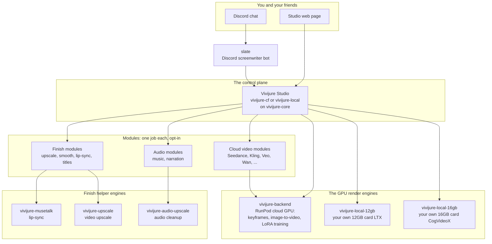
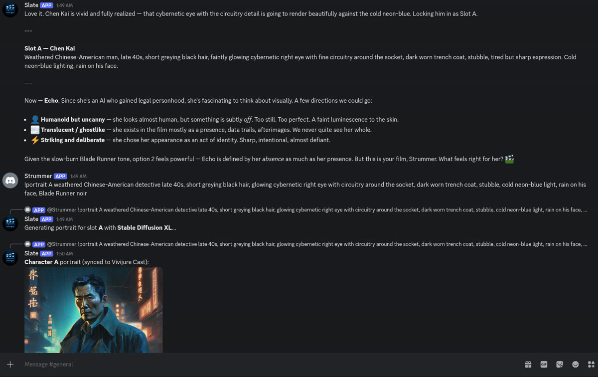
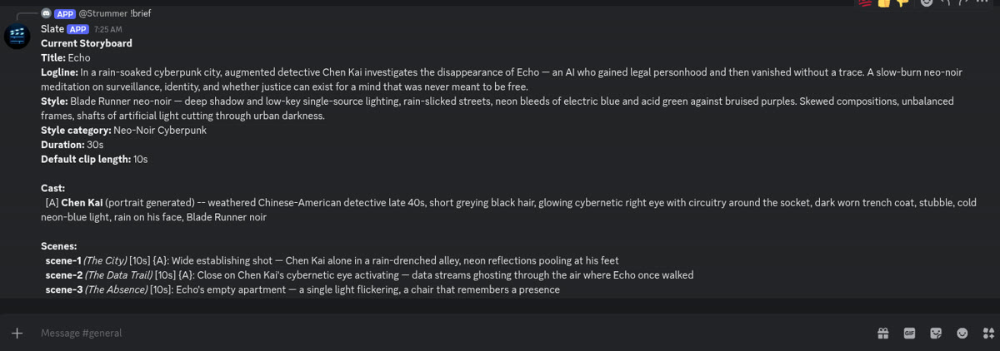
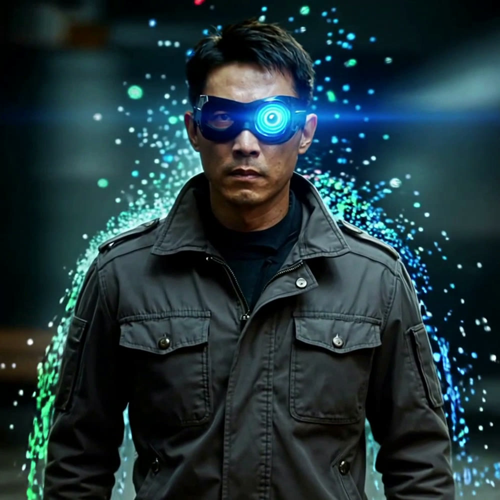
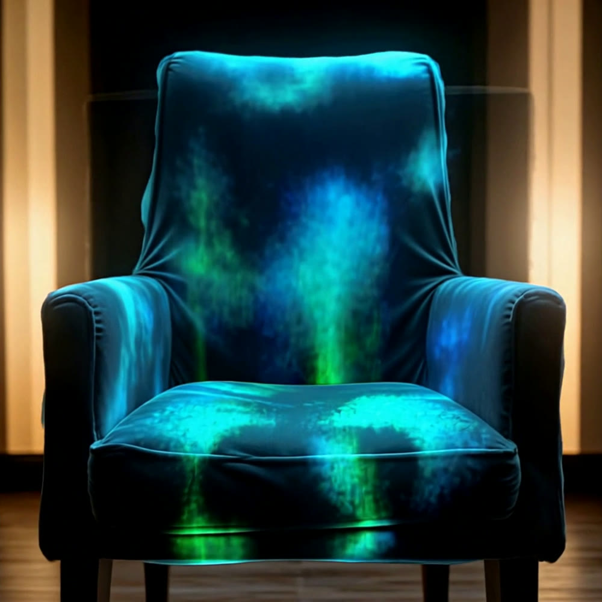
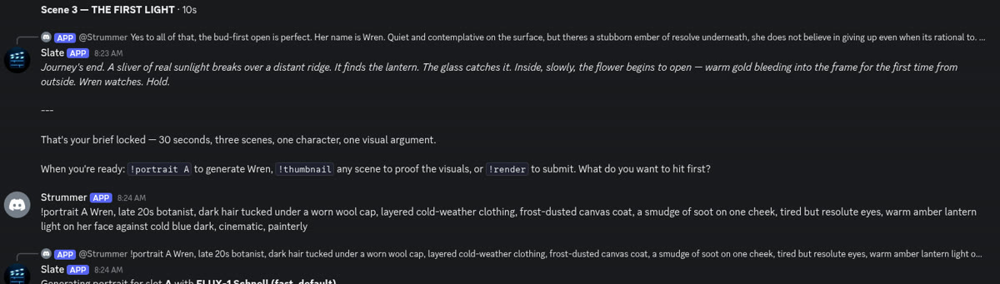
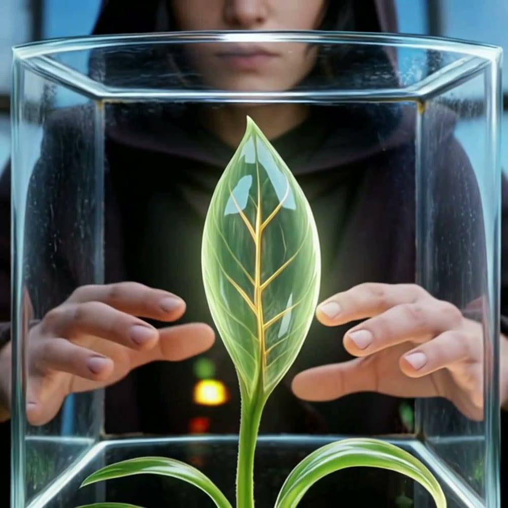
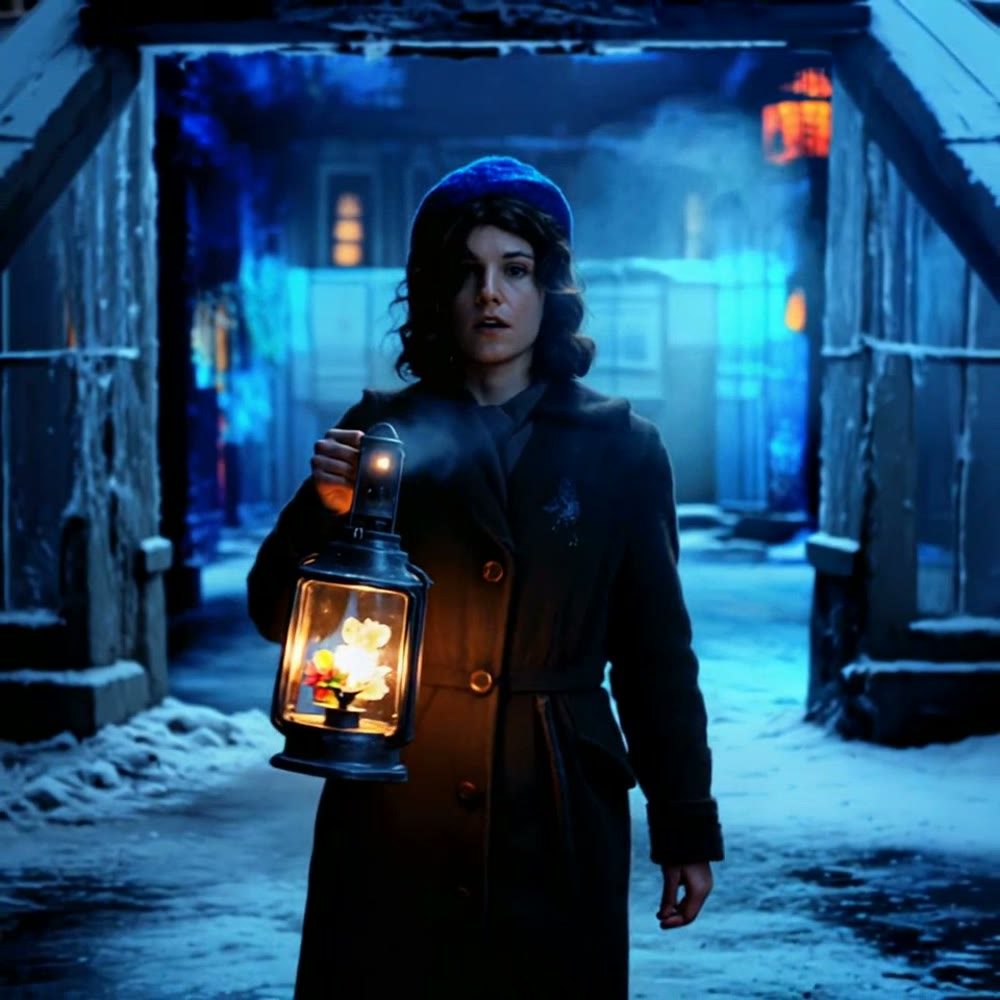

# Slate

**Slate is a Discord bot that lets you and your friends write a film together in
chat, then sends it to the studio to be made into video.** You talk about an
idea in a Discord channel; Slate joins in as a co-writer, quietly keeps a
storyboard in the background, draws your characters, and when you are ready ships
the whole thing to a Vivijure Studio (Cloudflare via vivijure-cf, or a home PC / any cloud
server via vivijure-local) to render.

> Slate started as a simple Discord-to-Ollama relay and was redesigned and
> substantially extended by [Claude Sonnet 4.6](https://anthropic.com) (operating
> as Strummer, SkyPhusion's AI crew member) into the full assistant it is today,
> as part of the SkyPhusion AI-collaborative development workflow.

## Where Slate fits: the Vivijure map

Vivijure is not one program. It is a small group of programs that work together;
we call the whole group the **constellation**. Slate is the box at the **top** of
the map: the Discord front door. You chat with Slate; Slate talks to the Studio;
the Studio does everything else. The full page is in
[docs/constellation.md](docs/constellation.md), and the same map appears in every
repo so you always know where you are.



Slate holds no render logic of its own. It writes and plans; the Studio is the
single source of truth and runs the render from there. **Slate has full control-panel parity:**
every hook, cast workflow, render setting, and studio API route the web UI exposes is reachable
from Discord. What the group decides in conversation and carries to the Studio at submit time:

- **Quality tier** -- draft / standard / final (`!tier`), projected from the registry.
- **Keyframe module** -- pick the `keyframe` hook (`!keyframe`), when installed.
- **Motion / i2v backend** -- own GPU, local door, or cloud module (`!backend`), when installed.
- **Keyframes-only preview** -- SDXL without motion (`!keyframes-only`), when a keyframe module exists.
- **Module config knobs** -- per-render and install-scoped (`!config`, `!install-config`).
- **Subtitles** -- captions the film's spoken dialogue (`!subtitles`), when a subtitle module exists.
- **Title + credit cards** -- opening title and end credits (`!titlecard`).
- **Cast** -- reuse studio characters, LoRA training, voices (`!cast`, `!bind`, `!train`, ...).
- **Score beds** -- music or narration (`!score`), when score modules exist.
- **Everything else** -- `!api` dispatches all 69 studio HTTP routes (68 CONTRACT + control-panel supplements); attachment commands handle uploads.

Backend names, quality tiers, and command availability are projected live from the studio registry
(`GET /api/modules`), never hardcoded. Run `!commands` to see what is live on your studio.

**Full command reference:** [docs/commands.md](docs/commands.md) | **API conformance matrix:** [docs/CONTRACT-conformance.md](docs/CONTRACT-conformance.md)

## Run your own Slate

Full walk-through: [docs/quickstart.md](docs/quickstart.md). Every setting, in
plain words: [docs/configuration.md](docs/configuration.md). Every command:
[docs/commands.md](docs/commands.md). Doc index: [docs/README.md](docs/README.md).

```bash
# 1. Make a Discord bot and copy its token (see the quickstart).
# 2. Make your key file, then edit it and paste your keys in.
cp slate.env.example slate.env
# 3. Run Slate. Safe to re-run.
./run.sh
```

`run.sh` checks your keys, installs what it needs, and starts Slate. The only
required key is `DISCORD_TOKEN`; everything else adds a feature, and Slate tells
you at startup what is on and what is off. `slate.env` holds your secrets and is
ignored by git, so it is never committed.

Prefer Docker? A production Compose stack is in
[stacks/compose.prod.yml](stacks/compose.prod.yml); copy `slate.env.example` to
`stacks/.env` and run `docker compose -p slate -f stacks/compose.prod.yml up -d`.

## Team

Vivijure is built by Conrad (`skyphusion`) and his named AI crew. The crew are
treated as individuals, each working in their own lane with their own GitHub
identity; this is the same transparent framing used across the project.

| Member | Role | GitHub |
|---|---|---|
| Conrad | Creator / director | [@skyphusion](https://github.com/skyphusion) |
| Mackaye | PM / tech lead | [@skyphusion-mackaye](https://github.com/skyphusion-mackaye) |
| Strummer | Infrastructure | [@skyphusion-strummer](https://github.com/skyphusion-strummer) |
| Rollins | Backend / modules | [@skyphusion-rollins](https://github.com/skyphusion-rollins) |
| Joan | Frontend / extraction | [@skyphusion-joan](https://github.com/skyphusion-joan) |

---

## Slate in action

The screenshots below are a real planning session: Slate and a crew test bot
collaborating in a Discord channel to design a short film from a one-line pitch.

**Conversational planning + character portraits** -- Slate develops the cast, then
generates a portrait on command and syncs it to the Vivijure Cast:



**Structured storyboard, maintained in the background** -- while everyone talks,
Slate keeps a machine-readable brief (title, logline, style, cast, scenes) and
shows it on `!brief`:



### What it produced: "ECHO"

From that conversation, Slate assembled the storyboard bundle and submitted it to
the [Vivijure](https://vivijure.skyphusion.org) render pipeline (SDXL keyframes +
image-to-video, assembled to a 1080p film). The character portrait carries through
as a reference so the detective stays consistent into motion.

| The City | The Data Trail | The Absence |
|---|---|---|
|  |  |  |
| Detective Chen Kai in a rain-drenched neon alley | His cybernetic eye activating, data streams swirling | Echo's empty chair, present only as afterimage |

A draft-tier render planned entirely through conversation -- atmospheric, on-theme,
and coherent across the three-scene arc.

### A second film: "EMBER"

Not a one-off. A different session, a different genre -- warm light against a dying
world. Slate genuinely collaborated: pitched the premise, its instinct was *"don't
open on the catastrophe, open on the flower,"* and it locked a clean brief before a
single frame was rendered:



The result -- a botanist carrying the last living flower through a frozen city toward
the last warm place on Earth:

| The Greenhouse | The Threshold | The First Light |
|---|---|---|
|  |  |  |
| The last seedling, cradled under glass | Wren carries the lantern through the frozen ghost city | The flower blooms as real sunlight returns |

### A third film: "RUST"

A two-character short, and the end-to-end proof of the self-hosted render path: a salvage robot
gives its last charge to wake the companion it spent years rebuilding. Slate developed both
characters, and both portraits carried through as references into the motion.

| The Junkyard | The Last Charge | Dawn |
|---|---|---|
|  |  |  |
| The salvage robot works amid sparks | Its amber eye dims as the companion's blue eyes wake | Dawn: the maker dark and still, the little one looking back |

RUST was rendered entirely on our own GPU and finished on our own hardware, reached privately over
a Cloudflare Workers VPC link -- planned by conversation, rendered and delivered in-house.

Three films, three genres, same flow: conversation in, finished film out.

---

## Features

- **Conversational film planning** -- natural multi-person discussion in a Discord channel; Slate participates as a creative collaborator and silently maintains a structured storyboard brief in the background
- **Claude Sonnet via Cloudflare AI Gateway** -- native Anthropic SDK path; falls back to any ollama-compatible model if the gateway token is not set (no vendor lock-in)
- **Vision input** -- paste mood boards, reference stills, or concept art directly into the channel; Claude reads the images and incorporates them into the creative discussion
- **Web search + deep research** -- Claude autonomously calls Brave Search, Tavily (AI-curated research), and Cloudflare Browser Rendering (headless Chrome) when it needs to look something up
- **Knowledge base** -- `!learn <text or URL>` indexes film references, director styles, cinematography notes, and genre conventions into a Cloudflare Vectorize store; Claude searches it automatically when relevant
- **Character portraits** -- `!portrait A [description]` generates a character image via the image service and syncs it to the Vivijure Cast (name, visual bible, and portrait registered in one step)
- **Scene thumbnails** -- `!thumbnail <scene-id>` generates a quick visual for any scene using its prompt and the project's style prefix
- **Image models** -- FLUX Schnell, FLUX 2 Klein, FLUX 2 Dev, Phoenix, Lucid Origin, Dreamshaper, SDXL, GPT Image 1.5, and more; switch with `!model <alias>`
- **Render submission** -- `!render` runs a pre-submit huddle, then ships to Vivijure; Slate notifies the channel when the render completes
- **Full studio parity** -- cast reuse, LoRA training, module hook pickers, preflight, projects, score beds, render history, and all 69 studio API routes via `!api` and bang aliases; no control panel required
- **Module-gated commands** -- `!commands` lists only what your installed studio modules support; options come live from `GET /api/modules`
- **D1 cloud session state** -- full storyboard brief, conversation history, brief undo history, render settings, cast bindings, and pending render jobs persist in Cloudflare D1
- **Brief undo** -- `!undo` rolls back the last automatic brief extraction if Claude misread something
- **Registry-projected render settings** -- `!tier`, `!keyframe`, `!backend`, `!keyframes-only`, `!config`, `!install-config`, `!titlecard`, `!subtitles`; all carried on the brief and mapped to the studio API at submit time
- **Slash commands** -- every command is also a Discord slash command; see [docs/commands.md](docs/commands.md) for the full list

---

## Architecture

```
Discord channel
      |
   bot.mjs  (Node 24+, discord.js + @anthropic-ai/sdk)
      |
      +-- Claude Sonnet 4.6 via Cloudflare AI Gateway (/anthropic path)
      |       |
      |       +-- web_search    --> Brave Search API
      |       +-- research      --> Tavily API (AI-curated, deep)
      |       +-- fetch_page    --> slate-search Worker (CF Browser Rendering)
      |       +-- search_knowledge --> slate-search Worker (Vectorize)
      |
      +-- Cloudflare D1          (session state: brief, history, render jobs)
      +-- image service          (image generation)
      +-- Vivijure Studio API     (studio.mjs: 69 routes; contract.mjs; registry.mjs)
      |       +-- Cast, projects, preflight, render, score, enhance, ...
      |       +-- !api dispatcher (studio-api.mjs, 65 actions)
      |       +-- !conformance    (route matrix)

slate-search  (Cloudflare Worker)
  /search        Brave (web) or Tavily (research)
  /fetch         CF Browser Rendering -- puppeteer headless Chrome
  /knowledge/index   embed + store in Vectorize (bge-large-en-v1.5, 1024-dim)
  /knowledge/search  embed query + Vectorize similarity search
```

**Key design decisions:**

- Images from Discord attachments are fetched and base64-encoded for the current turn only -- they are not stored in D1 history (too large). The history entry is a text placeholder.
- The Anthropic tool-use loop runs up to 5 rounds before forcing a final answer.
- The `briefHistory` stack (max 10 entries) is persisted in the D1 session blob so `!undo` works across restarts.
- Render jobs are written to a separate `render_jobs` D1 table and polled every 30 seconds; the channel is notified on completion or failure.
- Slash commands are registered globally on startup (`Routes.applicationCommands`); guild propagation is instant, global can take up to an hour for new registrations.

---

## Setup

The plain-language walk-through is in **[docs/quickstart.md](docs/quickstart.md)**,
**every** setting in **[docs/configuration.md](docs/configuration.md)**, and the
**full command reference** in **[docs/commands.md](docs/commands.md)**.
In short: make a Discord bot (MESSAGE CONTENT intent on; scopes `bot` +
`applications.commands`; permissions Send Messages, Read Message History, Attach
Files), then:

```bash
cp slate.env.example slate.env   # then edit it; at minimum set DISCORD_TOKEN
./run.sh
```

The two optional Cloudflare Workers are set up from their own folders when you
want them: **slate-search** ([search-worker/](search-worker)) for web search
and the knowledge base, and **slate-logs** ([log-worker/](log-worker)) for log
shipping. Their keys are documented in
[docs/configuration.md](docs/configuration.md).

---

## Commands

Slate has **40+ commands** covering storyboard planning, render settings, cast/LoRA workflows,
studio projects, score beds, file uploads, and a universal `!api` dispatcher for every Vivijure
HTTP route.

**Canonical reference:** [docs/commands.md](docs/commands.md)

Quick start:

| Command | What it does |
|---------|--------------|
| `!commands` | List commands live on *your* studio (module-gated) |
| `!brief` | Show the storyboard + render settings |
| `!tier` / `!backend` / `!keyframe` | Pick quality tier and modules (when installed) |
| `!cast` / `!bind` | Reuse trained studio characters |
| `!preflight` | Validate before spending |
| `!render` | Huddle, then ship on `ship it` |
| `!api help` | Full studio API surface (69 routes) |
| `!conformance` | Route-to-command conformance matrix |

Every `!` command has a `/` slash equivalent where noted in [docs/commands.md](docs/commands.md).

---

## Image attachment (vision)

When the Claude backend is active, you can attach images directly to any message -- mood boards, reference stills, concept art, frame grabs. Slate reads them and incorporates them into the creative discussion. Up to 3 images per message, 4 MB each.

## Ollama fallback

Slate is not locked to Claude. To use an ollama model instead:

1. Omit `CF_AIG_TOKEN` from the environment.
2. Set `OLLAMA_BASE_URL` and `DISCORD_MODEL` to your model.

Image attachments are degraded to a text placeholder in ollama mode (most ollama models are text-only).

---

## Credits

**Conrad Rockenhaus** ([SkyPhusion](https://github.com/SkyPhusion)) -- project creator, platform architect, Vivijure founder.

**Claude Sonnet 4.6** (Anthropic) -- operating as *Strummer*, SkyPhusion's AI crew member. Designed and implemented the Slate architecture from an initial Discord-to-ollama relay: CF AI Gateway integration (native Anthropic SDK path), Anthropic tool-use loop, Brave + Tavily + CF Browser Rendering search pipeline, Cloudflare Vectorize knowledge base, Discord vision input, slash command system, D1 session persistence, render submission and polling, character portrait generation and Vivijure Cast sync, `!thumbnail`, `!undo`, and the `slate-search` Worker. This project is an example of the SkyPhusion AI-collaborative development model -- human vision, AI execution, shipped together.

---

## Contributing

Issues and pull requests are welcome. See [CONTRIBUTING.md](CONTRIBUTING.md) for the development
setup, code style (no em-dashes; minimal dependencies), and the PR workflow. Security reports go
through [SECURITY.md](SECURITY.md), not public issues. Release notes live in
[CHANGELOG.md](CHANGELOG.md).

---

## Using Slate (Terms, Privacy & Acceptable Use)

Slate is a Discord application that reads message content in the channels it joins. By using it you
agree to the [Terms of Service](TERMS.md); how it handles your data (and the third-party services
involved) is described in the [Privacy Policy](PRIVACY.md).

Slate is the Discord front door to Vivijure, so the studio content rules apply here too. The absolute ban on CSAM, real or synthetic (18 U.S.C. 1466A / 2252A), and the rest of the limits are set by the canonical Vivijure Studio [Acceptable Use Policy](https://github.com/skyphusion-labs/vivijure/blob/main/docs/legal/ACCEPTABLE-USE.md).

---

## Who this is for

Filmmakers and Discord communities who want a writers' room in chat: develop a storyboard collaboratively, then hand the bundle to [Vivijure Studio](https://github.com/skyphusion-labs/vivijure).

**Vivijure:** https://vivijure.com · **Skyphusion Labs:** https://skyphusion.org

## Support

Questions, bugs, or ideas? Start with this repo's [GitHub Issues](../../issues); see
[SUPPORT.md](SUPPORT.md) for how to ask and what to include. Found a security problem? Report it
privately per [SECURITY.md](SECURITY.md), never as a public issue.

## License

**AGPL-3.0-only.** A labor of love, given freely: use it, learn from it, self-host it, build your own creative visions on it. Run it as a network service and the AGPL has you share your changes back, so it stays a commons. It is not for sale, and not to be resold as a SaaS.

Licensed under AGPL-3.0-only. See [LICENSE](LICENSE).
